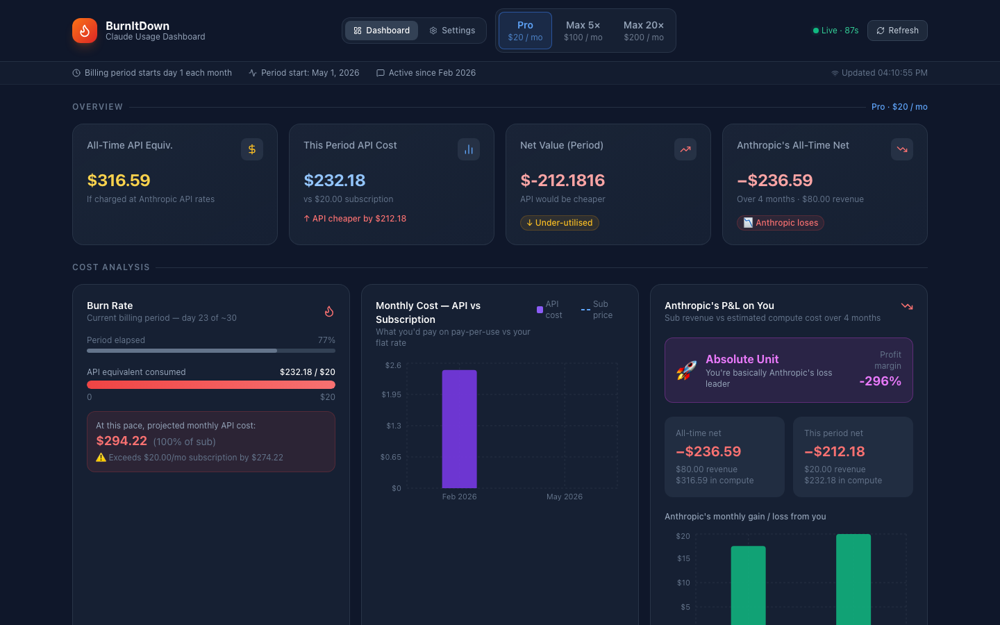

# 🔥 ClaudeWatch — Claude Usage Dashboard

A local, real-time dashboard that reads your **Claude Code** session files
(`~/.claude/projects/**/*.jsonl`), computes the dollar value of every token
you've consumed at Anthropic's public API rates, and compares it against the
flat subscription you actually pay.

The headline question this dashboard answers:

> **How much of Anthropic's data-centre spend on your usage is being
> subsidised by their subscription pricing, vs how much you're actually paying
> for?**

Most heavy Claude Code users are net-negative for Anthropic on a unit-economics
basis. This dashboard makes that subsidy visible — for one user, in their own
data, in real time.



---

## Table of contents

1. [Getting started](#getting-started)
2. [What the dashboard shows](#what-the-dashboard-shows)
3. [How cost is computed](#how-cost-is-computed)
4. [Subscription tiers](#subscription-tiers)
5. [Configuration](#configuration)
6. [Troubleshooting](#troubleshooting)
7. [Running the tests](#running-the-tests)
8. [Pricing sources](#pricing-sources)
9. [Why this matters](#why-this-matters)
10. [License & attribution](#license--attribution)

---

## Getting started

### Prerequisites

| Requirement | Version |
|---|---|
| Node.js | ≥ 18 |
| npm | ≥ 9 |
| Claude Code CLI | installed and used at least once (so `~/.claude` exists) |

### 60-second install

```bash
# 1. Clone
git clone https://github.com/currentsea/claudewatch.git
cd claudewatch

# 2. Install
npm install

# 3. (optional) point at a non-default Claude data dir, change billing day, etc.
cp .env.example .env
$EDITOR .env

# 4. Run — starts both the API and the React dashboard
npm start
```

`npm start` launches two processes in parallel:

- **Backend** at `http://localhost:3001` — reads `~/.claude` and serves
  aggregated JSON.
- **Frontend** at `http://localhost:3005` — opens automatically in your
  browser.

You should see the dashboard populated within a second or two. If you don't,
jump to [Troubleshooting](#troubleshooting).

### Running the pieces independently

```bash
npm run server   # API only (port 3001)
npm run client   # React dev server only (port 3005)
```

### Verifying it works

1. Open `http://localhost:3005` and confirm the "Live · 90s" badge in the
   header is pulsing green.
2. Open Claude Code in another terminal, send a single message, and wait for
   the next refresh. You should see:
   - A new entry in the **Tick History** table.
   - A bump in the **All-Time API Equiv.** stat card.
   - (If within 5 hours) a row in **Active usage windows**.
3. Click any row in the **Session P&L** table to open the per-message
   drilldown.

---

## What the dashboard shows

| Section | What it tells you |
|---|---|
| **Subsidy hero (top)** | One sentence: is Anthropic eating money to serve you, or making a margin? With a single split bar showing what you paid vs what they ate. |
| **Stat cards** | All-time API-equivalent cost, this-period cost vs subscription, net value, Anthropic's all-time P&L on you. |
| **Active usage windows** | Sessions touched in the last 5 h (Claude's rolling usage window). Shows incurred cost and remaining time until the window closes. |
| **Burn meter** | Where you are in your billing period — current spend, projected month-end spend, and whether you'll exceed your subscription. |
| **Monthly comparison chart** | Per-month API-equivalent cost bars against your flat subscription line. |
| **Anthropic P&L** | A per-month bar chart of revenue (your sub) minus your compute cost. Plus a "what kind of customer am I to Anthropic" label. |
| **Cost-flow diagram** | A step-by-step visualisation of how raw tokens become dollars become P&L. Useful for understanding (and trusting) the numbers. |
| **Sustainability links** | Background reading on why subsidising heavy users isn't a long-term equilibrium. |
| **Tick history** | One row per refresh interval where new tokens were consumed. Real-time spend granularity. |
| **Daily P&L** | Daily API-cost bars vs the per-day subscription allocation (`$sub / 30`). |
| **Session table → click any row** | Per-session drilldown: full message timeline, per-model token breakdown, working directory, git branch. |

---

## How cost is computed

For every assistant message in `~/.claude/projects/**/*.jsonl`, the server
reads the `usage` block and applies the configured API rate for that model's
tier:

```
cost = (input_tokens          × input_rate        / 1 000 000)
     + (output_tokens         × output_rate       / 1 000 000)
     + (cache_creation_tokens × cache_write_rate  / 1 000 000)
     + (cache_read_tokens     × cache_read_rate   / 1 000 000)
```

The model id (e.g. `claude-opus-4-8`, `claude-sonnet-4-6`) is mapped to the
Opus / Sonnet / Haiku tier and the matching rate is used. The mapping is
substring-based — any model id containing `opus` → opus, containing `haiku` →
haiku, else → sonnet.

> See the in-app **"How we get the numbers"** section for an interactive
> flowchart of this calculation against your own data.

### Default rates (USD per 1M tokens, June 2026)

| Model | Input | Output | 5m cache-write | Cache read |
|---|---|---|---|---|
| **Claude Opus 4.5+** (4.5, 4.6, 4.7, 4.8) | $5 | $25 | $6.25 | $0.50 |
| **Claude Sonnet 4.5+** (4.5, 4.6) | $3 | $15 | $3.75 | $0.30 |
| **Claude Haiku 4.5** | $1 | $5 | $1.25 | $0.10 |

> **Older Opus (4.1 and earlier)** is 3× more expensive at $15/$75. If your
> JSONL files were produced by an older Opus version and you want exact
> numbers, edit the rate in **Settings**.

### Editing rates in-app

Open **Settings → Model API Rates** to override any value. Changes are:
- Saved to `localStorage` immediately
- Applied to all dashboard calculations on the next refresh tick
- Reversible per-model with the ↺ reset button

---

## Subscription tiers

Toggle between three reference tiers in the dashboard header:

| Tier | Monthly cost | Typical plan |
|---|---|---|
| **Pro** | $20 | Claude.ai Pro (individual) |
| **Max 5×** | $100 | Claude.ai Max (5× usage) |
| **Max 20×** | $200 | Claude.ai Max (20× usage) |

The tier you pick is purely a comparison baseline — the dashboard subtracts
your API-equivalent compute cost from it to compute the per-period P&L.

**Custom tier costs:** click **Settings** to edit. Useful if you're on annual
billing, a team plan, or a regional price.

---

## Configuration

Copy `.env.example` to `.env` and override any of the following.

### Backend variables (read by `server/index.js`)

| Variable | Default | Description |
|---|---|---|
| `CLAUDE_DATA_PATH` | `~/.claude` | Absolute path to your Claude Code data directory. Only change if you moved it. |
| `SERVER_PORT` | `3001` | TCP port for the Express API server. If you change this, also update the `proxy` field in `package.json`. |
| `BILLING_DAY` | `30` | Day-of-month when your Anthropic subscription renews. E.g. `15` if you subscribed on the 15th. |
| `CLAUDE_USAGE_WINDOW_HOURS` | `5` | Length of Claude's rolling usage window. Used to compute "active sessions" remaining time. |

### Frontend variables (REACT_APP_* are baked in at build time)

| Variable | Default | Description |
|---|---|---|
| `REACT_APP_REFRESH_INTERVAL` | `90` | Polling interval in **seconds**. Lower = more real-time. Minimum recommended: 5. |

---

## Troubleshooting

### "Could not connect to the API server"

The frontend is up but the backend isn't.

```bash
# Is the backend actually running?
lsof -i:3001

# If not, start it manually so you can see the logs:
npm run server
```

Common causes:
- Port 3001 is already in use → see "Port 3001 already in use" below.
- `CLAUDE_DATA_PATH` is wrong → check the line `📁 Claude data path → …` in
  the server logs.

### Port 3001 already in use

The server prints clear instructions, but the one-liner:

```bash
lsof -ti:3001 | xargs kill -9
npm start
```

Or change the port in `.env` (also update `package.json` → `proxy` so the
React dev server knows where to forward `/api/*`).

### Dashboard shows all zeroes

The backend can read `~/.claude` but there's no usage data in it yet.

```bash
# Confirm the data files exist:
ls ~/.claude/projects/*/*.jsonl | head -5

# Confirm Claude Code itself works:
claude --version
```

If `~/.claude/projects` exists but is empty: send at least one message in
Claude Code, then click **Refresh** in the dashboard.

### Costs look wildly wrong

- **Costs are 3× expected, you're on Opus:** your JSONL files were produced
  by Opus 4.1 (or earlier), but the new defaults assume Opus 4.5+ pricing
  ($5/$25 vs $15/$75). Open Settings → Opus → set input to `15`, output to
  `75`.
- **Costs are 3× too low, you're on Opus:** opposite of the above — your
  JSONL was produced by Opus 4.5+ but you've edited rates back to old values.
  Hit ↺ to reset to defaults.
- **Cache hit rate is suspiciously high/low:** the dashboard reports what's
  in `usage.cache_read_input_tokens` and `usage.cache_creation_input_tokens`.
  These reflect Anthropic's reported caching behaviour and are not adjustable.

### "Anthropic loses money on you" is showing positive

Either:
- Your subscription tier in the header is too high relative to your usage
  (try Pro $20 instead of Max 20× $200), or
- You haven't used Claude much this billing period yet.

Both are fine — that's exactly the kind of customer the subscription pricing
is designed to attract.

### Active sessions panel is empty

A session needs activity in the last 5 hours (configurable via
`CLAUDE_USAGE_WINDOW_HOURS`). If you only use Claude in spurts and nothing
has happened recently, this panel will be empty until the next message.

### The frontend won't compile (`react-scripts` errors)

```bash
# Nuke and reinstall
rm -rf node_modules package-lock.json
npm install
npm start
```

If you're on Node 18+ and still seeing OpenSSL errors:

```bash
NODE_OPTIONS=--openssl-legacy-provider npm start
```

### Session drilldown shows "Session not found"

This means the `?id=<...>` in the request doesn't match any file's basename
under `~/.claude/projects/`. Most common cause: the dashboard was loaded
before that session was created, and the cached list is stale. Hit **Refresh**
and try again.

---

## Running the tests

The repo ships with 128 unit tests covering all the pricing, billing-period
and project-name-extraction logic, plus an integration test that the
dashboard renders without crashing.

```bash
# All tests (frontend + server) — one shot, no watch:
npm run test:ci

# Frontend only (watch mode, interactive):
npm test

# Server only:
npm run test:server
```

Test files:

- `src/utils/pricing.test.ts` — 48 tests covering frontend formatting, P&L,
  subscription tier construction, localStorage round-trips, default-pricing
  invariants, edge cases (zero, negative, null dates, malformed JSON).
- `src/App.test.tsx` — 32 tests covering dashboard rendering, navigation
  tabs, the dark/light theme toggle, provider switching, and the aggregates
  subdashboard.
- `server/pricing.test.js` and `server/db.test.js` — 48 tests covering
  server-side cost computation, pricing overrides, billing-period boundary
  cases (including year wrap), project-name extraction, the demo-mode cutoff,
  and the SQLite price-history / aggregates layer.

---

## Pricing sources

The default rates are taken directly from Anthropic's public documentation.

| Source | URL | What it covers |
|---|---|---|
| **Anthropic Pricing docs** | [docs.anthropic.com/en/docs/about-claude/pricing](https://docs.anthropic.com/en/docs/about-claude/pricing) | Authoritative per-token input / output / cache rates for every model. |
| **Anthropic pricing page** | [anthropic.com/pricing](https://www.anthropic.com/pricing) | Plain-English pricing summary. |
| **Model overview** | [docs.anthropic.com/en/docs/about-claude/models/overview](https://docs.anthropic.com/en/docs/about-claude/models/overview) | Maps model ID strings (found in JSONL files) to Opus / Sonnet / Haiku tiers. |
| **Claude.ai plans** | [claude.ai/upgrade](https://claude.ai/upgrade) | Flat-rate subscription costs: Pro $20/mo, Max 5× $100/mo, Max 20× $200/mo. |
| **Prompt Caching** | [docs.anthropic.com/en/docs/build-with-claude/prompt-caching](https://docs.anthropic.com/en/docs/build-with-claude/prompt-caching) | 5m cache write = 1.25× input rate, cache read = 0.1× input rate. |

> Defaults verified **June 2026**. If Anthropic changes rates, override in
> **Settings** — your changes persist in `localStorage` without needing a
> code change.

---

## Why this matters

The dashboard isn't just a curiosity. It surfaces a real industry-wide
imbalance: frontier model training compute roughly **doubles every 6 months**
(Epoch AI), while subscription tiers stay flat at $20–$200/mo. The gap is
funded by capital, not unit economics. Background reading is linked in the
in-app **"Why this is not sustainable"** sidebar:

- Epoch AI — [Training compute of frontier AI models grows ~4.5×/year](https://epoch.ai/blog/training-compute-of-frontier-ai-models-grows-by-4-5x-per-year)
- Stanford [AI Index](https://aiindex.stanford.edu/report/) — annual report on training-cost trajectories
- Goldman Sachs — [Gen AI: too much spend, too little benefit?](https://www.goldmansachs.com/insights/articles/gen-ai-too-much-spend-too-little-benefit)
- [SemiAnalysis](https://semianalysis.com/) — ongoing coverage of the inference price war

If Anthropic is losing $30/mo on your usage (as this dashboard might show
you), they are betting that they'll either (a) eventually raise prices,
(b) drive inference costs down faster than your usage grows, or (c) you'll
graduate to API billing. None of those are guaranteed.

---

## Project structure

```
claudewatch/
├── LICENSE                            # MIT, © Joseph Bull
├── README.md                          # you are here
├── docs/                              # screenshots
├── server/
│   ├── index.js                       # Express API server (binds 127.0.0.1)
│   ├── pricing.js                     # pure cost/billing helpers (testable)
│   ├── pricing.test.js                # server pricing/billing tests
│   ├── db.js                          # SQLite price-history + aggregates
│   └── db.test.js                     # database-layer tests
├── scripts/
│   ├── regenerate-stats-cache.js      # rebuild ~/.claude/stats-cache.json
│   └── take-screenshots.js            # regenerate the README screenshots
├── src/
│   ├── App.tsx                        # main dashboard
│   ├── App.test.tsx                   # dashboard render / navigation tests
│   ├── hooks/useUsageData.ts          # polling + tick detection
│   ├── types/index.ts                 # TypeScript domain types
│   ├── utils/pricing.ts               # frontend pricing helpers
│   ├── utils/pricing.test.ts          # frontend pricing/formatting tests
│   └── components/
│       ├── SubsidyHero.tsx            ← top-of-page subsidy story
│       ├── CostFlowDiagram.tsx        ← step-by-step cost computation
│       ├── ActiveSessionsPanel.tsx    ← live usage-window panel
│       ├── SessionActivityChart.tsx   ← active vs by-day activity chart
│       ├── SessionsTable.tsx          ← per-session P&L table
│       ├── SessionDrilldownModal.tsx  ← per-session message timeline
│       ├── DrilldownModal.tsx         ← shared metric-breakdown modal
│       ├── AggregatesDashboard.tsx    ← project × month × model rollups
│       ├── AnthropicPnL.tsx           ← all-time Anthropic P&L
│       ├── BurnMeter.tsx
│       ├── PricingSettingsPanel.tsx
│       ├── StatCard.tsx
│       ├── SubscriptionSelector.tsx
│       ├── ProviderSelector.tsx
│       ├── ComingSoonProvider.tsx
│       ├── LandingPage.tsx
│       ├── DonatePage.tsx
│       └── NoDataInstall.tsx
├── .env.example
├── tailwind.config.js
└── package.json
```

---

## License & attribution

[MIT licensed](./LICENSE).

© 2026 [Joseph Bull](https://github.com/currentsea). Repo:
[github.com/currentsea/claudewatch](https://github.com/currentsea/claudewatch).

ClaudeWatch is **not** affiliated with Anthropic. The cost numbers are
estimates derived from Anthropic's publicly published API rates; they are
not Anthropic's real margins.
