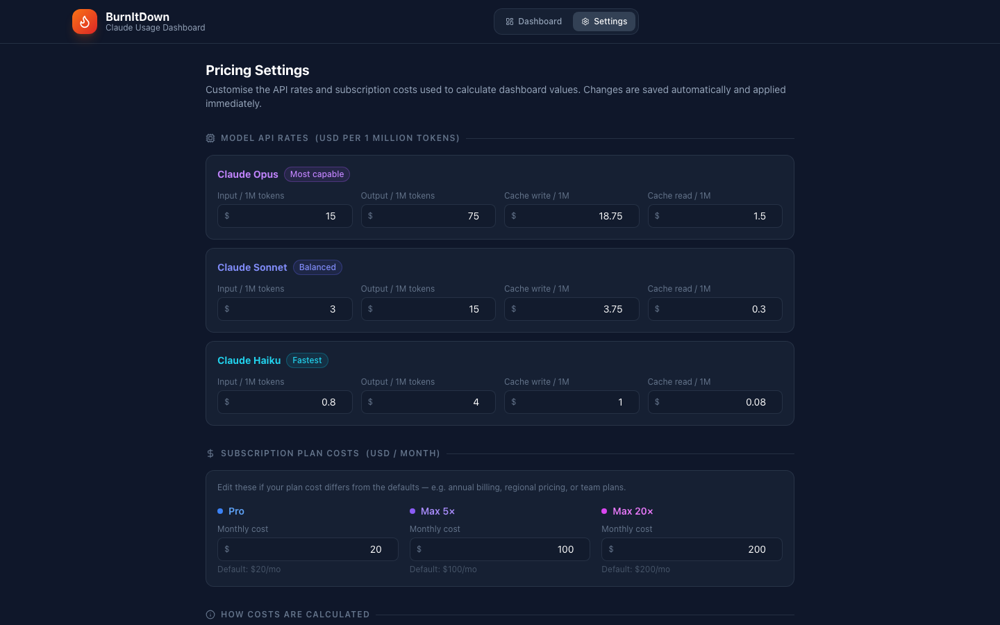

# 🔥 BurnItDown — Claude Usage Dashboard

A real-time dashboard that reads your local **Claude Code** (`~/.claude`) data files, calculates the API-equivalent cost of every token you have consumed, and compares it against your flat-rate subscription — so you can see exactly whether you are burning through value or leaving money on the table.

---

## Screenshots

### Dashboard


### Pricing Settings



---

## Features

The dashboard is focused on one question: **how much is Anthropic spending to serve you vs. how much you pay them in subscription?**

| Feature | Detail |
|---|---|
| 💰 **Cost stat cards** | All-time API-equivalent spend, this-period spend, net value vs subscription, and Anthropic's all-time net P&L |
| 🔥 **Burn meter** | Projects current-period spend to a full month and shows delta vs your subscription |
| 📊 **Monthly comparison** | Per-month API cost bars against your flat subscription line |
| 📉 **Anthropic P&L** | Their revenue (your subscription × months) minus their estimated compute cost — over your entire history |
| ⏱️ **Spending per tick** | Every refresh interval (default 1m 30s), records the incremental cost since the last tick; paginated 10/page |
| 📅 **Billing period** | Configurable start day so numbers align with your actual renewal date |
| ⚙️ **Pricing settings** | Edit every API rate and subscription cost in-app; persisted to `localStorage` |
| 🎨 **Responsive dark UI** | Tailwind CSS, works on desktop and mobile |

---

## Prerequisites

| Requirement | Version |
|---|---|
| Node.js | >= 18 |
| npm | >= 9 |
| Claude Code CLI | installed and used at least once |

---

## Quick Start

```bash
# 1. Install dependencies
npm install

# 2. Optional: copy and edit the environment file
cp .env.example .env

# 3. Start both servers with one command
npm start
```

`npm start` launches:
- **Backend API** on `http://localhost:3001` — reads `~/.claude`
- **React frontend** on `http://localhost:3000` — auto-opens in your browser

You can also run them separately:

```bash
npm run server   # start only the API server
npm run client   # start only the React dev server
```

---

## Configuration

Copy `.env.example` to `.env` and override any variables you need.

### Backend variables (read by `server/index.js`)

| Variable | Default | Description |
|---|---|---|
| `CLAUDE_DATA_PATH` | `~/.claude` | Absolute path to your Claude Code data directory. Only change if you moved it. |
| `SERVER_PORT` | `3001` | TCP port for the Express API server. If you change this, also update the `proxy` field in `package.json`. |
| `BILLING_DAY` | `1` | Day-of-month when your Anthropic subscription renews. E.g. `15` if you subscribed on the 15th. |

### Frontend variables (REACT_APP_* are baked in at build time)

| Variable | Default | Description |
|---|---|---|
| `REACT_APP_REFRESH_INTERVAL` | `10` | Polling interval in **seconds**. Lower = more real-time. Minimum recommended: 5. |

---

## Subscription tiers

Toggle between three reference tiers in the dashboard header:

| Tier | Monthly cost | Typical plan |
|---|---|---|
| **Pro** | $20 | Claude.ai Pro (individual) |
| **Max 5x** | $100 | Claude.ai Max (5x usage) |
| **Max 20x** | $200 | Claude.ai Max (20x usage) |

The dashboard computes the **API-equivalent** cost of your actual usage and shows the net savings (or deficit) vs the selected tier.

> **Customising tier costs:** click **Settings** in the header to edit the monthly cost of each tier.  This is useful if you're on annual billing, a team plan, or a regional price.

---

## How cost estimation works

For each assistant message in `~/.claude/projects/**/*.jsonl`, the server reads the `usage` block and multiplies by the configured API rates:

```
cost = (input_tokens          × input_rate        / 1 000 000)
     + (output_tokens         × output_rate       / 1 000 000)
     + (cache_creation_tokens × cache_write_rate  / 1 000 000)
     + (cache_read_tokens     × cache_read_rate   / 1 000 000)
```

The model name (e.g. `claude-opus-4-5`, `claude-sonnet-4-5`) is mapped to the Opus / Sonnet / Haiku tier and the matching rate is used.

### Default rates (USD per 1 million tokens)

| Model | Input | Output | Cache write | Cache read |
|---|---|---|---|---|
| **Claude Opus** | $15 | $75 | $18.75 | $1.50 |
| **Claude Sonnet** | $3 | $15 | $3.75 | $0.30 |
| **Claude Haiku** | $0.80 | $4 | $1.00 | $0.08 |

These are estimates — your Claude.ai subscription is flat-rate. The numbers show what the same usage would cost on pay-per-use API billing.

### Editing rates in-app

Open **Settings → Model API Rates** to change any value.  Changes are:
- saved to `localStorage` immediately
- applied to all dashboard calculations on the next data refresh

You can also reset individual models (or all models) to their defaults with the **↺ reset** button.

---

## Pricing sources

The default rates are taken directly from Anthropic's public documentation.

| Source | URL | What it covers |
|---|---|---|
| **Anthropic Pricing page** | [anthropic.com/pricing](https://www.anthropic.com/pricing) | Per-token input / output / cache rates for every model tier |
| **Model overview (Anthropic Docs)** | [docs.anthropic.com/en/docs/about-claude/models/overview](https://docs.anthropic.com/en/docs/about-claude/models/overview) | Maps model ID strings (found in JSONL files) to Opus / Sonnet / Haiku pricing tiers |
| **Claude.ai plans** | [claude.ai/upgrade](https://claude.ai/upgrade) | Flat-rate subscription costs: Pro $20/mo, Max 5× $100/mo, Max 20× $200/mo |
| **Prompt Caching (Anthropic Docs)** | [docs.anthropic.com/en/docs/build-with-claude/prompt-caching](https://docs.anthropic.com/en/docs/build-with-claude/prompt-caching) | Cache write = 125% of input rate; cache read = 10% of input rate; defines the `cache_creation_input_tokens` / `cache_read_input_tokens` fields |

> Rates verified **May 2025**.  If Anthropic changes pricing, update the fields in **Settings** — they persist in your browser without needing a code change.

---

## Project structure

```
burnitdown/
├── docs/
│   ├── screenshot-dashboard.png
│   └── screenshot-settings.png
├── server/
│   └── index.js               # Express API server (accepts ?pricing= override)
├── src/
│   ├── App.tsx                 # Main app — dashboard + settings pages
│   ├── index.css               # Tailwind directives
│   ├── types/index.ts
│   ├── utils/pricing.ts        # DEFAULT_PRICING_SETTINGS, localStorage helpers
│   ├── hooks/useUsageData.ts   # Polling hook (passes custom pricing to server)
│   └── components/
│       ├── PricingSettingsPanel.tsx  ← NEW — editable pricing UI + sources
│       ├── StatCard.tsx
│       ├── UsageChart.tsx
│       ├── ModelBreakdown.tsx
│       ├── CostComparison.tsx
│       ├── BurnMeter.tsx
│       ├── TokenBreakdown.tsx
│       ├── SessionsTable.tsx
│       ├── SubscriptionSelector.tsx
│       └── AnthropicPnL.tsx
├── .env.example
├── tailwind.config.js
└── package.json
```

---

## License

MIT
